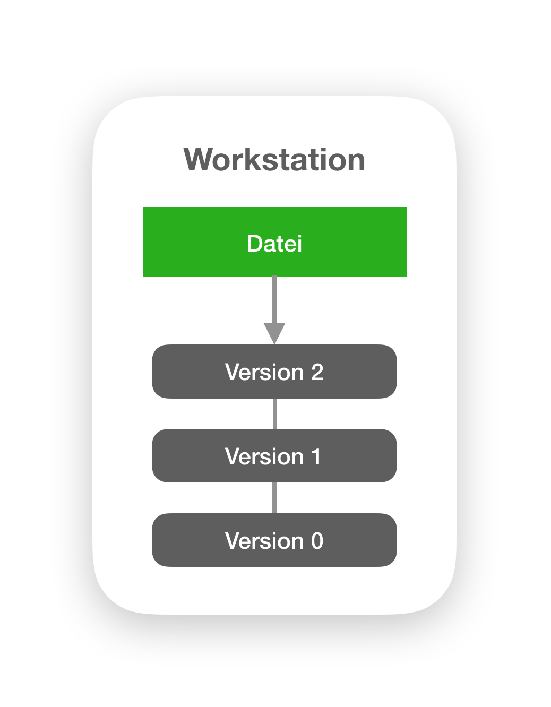

Ein Überblick über Code- und Versionsverwaltungssysteme
=================================================
*[Zur Themenübersicht](../../themen.md)*

Inhalt
------
1. [Einleitung](#einleitung)
2. [Zielgruppe von Versionsverwaltungssystemen](#zielgruppe)
2. [Grundlegende Strukturen von VCS](#strukturen)

Einleitung
----------

Versionsverwaltungssysteme (kurz VCS) sind Systeme, die Änderungen in Dateien ablegt, um es zu ermöglichen später zu einem älteren Zustand zurückzukehren. ([Git](https://git-scm.com/book/en/v2/Getting-Started-About-Version-Control))
Das bedeutet insbesondere, dass Fehler rückgängig gemacht werden können und deine Kollegen gleichzeitig möglichst ungestört weiterarbeiten können. ([Atlassian](https://www.atlassian.com/git/tutorials/what-is-version-control))
Jeder hat vermutlich schon einmal mit solch einem Versionsverwaltungssystem zu tun gehabt, oder gearbeitet. Dabei stellt sich beim Starten eines neuen Projekts  häufig die Frage, welches Versionsverwaltingssystem für das Projekt genutzt werden soll. Oft wird bei auf diese Frage mit dem System namens Git geantwortet, da dies das am weitesten verbreitete und am meisten verwendete Versionsverwaltungssystem ist. Es existieren somit auch sehr viele Online Services, die einen hosting Service von Online Git Repositorys zur Verfügung stellen. Eines dieser Systeme ist Github. Github biete die Möglichkeit kostenlos öffentliche Git Repositorys zu erstellen, die genutzt werden können, um den eigenen Code zu verwalten. Somit ist Github eine der größten Plattformen für Open Source Software. Ähnlich sieht es bei anderen Anbietern solcher Services, wie GitLab aus. Auch die Verteilung von freier Software werden häufig solche Services verwendet. Versionsverwaltungssysteme scheinen also nicht unbedeutend für die Existenz von Open Source Projekten zu sein.
Um die Frage darüber, welches Versionsverwaltungssystem man für eigene Projekte verwendet, etwas differenzierter als nur mit "Git" zu beantworten zu konnen und die Vor- und Nachteile der Verschiedenen Versionsverwaltungssysteme zu verstehen, soll diese Arbeit einen kleinen Überblick über die verschiedenen Versionsverwaltungssysteme inklusive deren Stärken und Schwächen geben.

Zielgruppe von Versionsverwaltungssystemen
------------------------------------------

Auf Versionsverwaltungssysteme stößt man zwar besonders häufig in der Softwareentwicklung, aber auch in anderen Bereichen ergibt ein Einsatz solcher Systeme Sinn. Ein Beispiel wäre die Hardwareentwicklung. Dort gibt es viele Ansätze auch Versionsverwaltungssysteme zu nutzen, die ursprünglich für die Softwareentwicklung entworfen wurden. ([ERPNext](https://discuss.erpnext.com/t/erpnext-git-github-for-open-source-hardware-call-for-beta-user-s/18006)) Auch für Webdesigner und alle anderen, die mit sich ändernden Dateien Arbeiten ist der Einsatz von Versionsverwaltungssysteme sinnvoll und vereinfacht die Arbeit an vielen Stellen.
In dieser Arbeot werde ich jedoch besonder auf die Sicht der Programmierung eingehen, da es für das Thema der Open Source Software am interessantesten ist. Die Versionsverwaltungssysteme, die ich in dieser Arbeit beschreiben werde, verwalten also Source Code und werden somit auch Codeverwaltungssysteme genannt.

Grundlegende Strukturen von VCS
-------------------------------

Um den Vergleich zwischen Versionsverwaltungssystemen zu ermöglichen, werden Informationen über die interne Struktur solcher Systeme benötigt, da aus der internen Struktur auch direkt Ideen und Ansätze für die Schnittstelle des jeweiligen Systems folgen. Außerdem sind die internen Strukturen nicht unwichtig für den Workflow, den diese Versionsverwaltungssysteme haben.
Grundsätzlich existieren drei Aufbauten von Versionsverwaltungssystemen. Dazu gehört der lokale, der zentralisierte und der verteilte Ansatz des Aufbaus.
Beim lokalen Ansatz handelt es sich um den einfachsten der drei Ansätze. Er basiert darauf, dass alle Änderungen lokal abgelegt und verwaltet werden. Dies ist in dieser Abbildung vereinfacht veranschaulicht:

